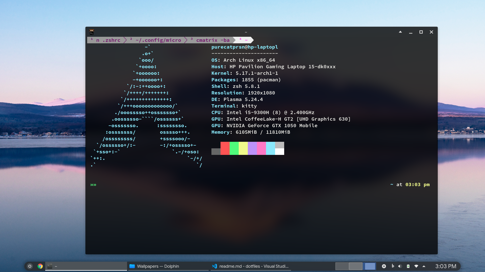
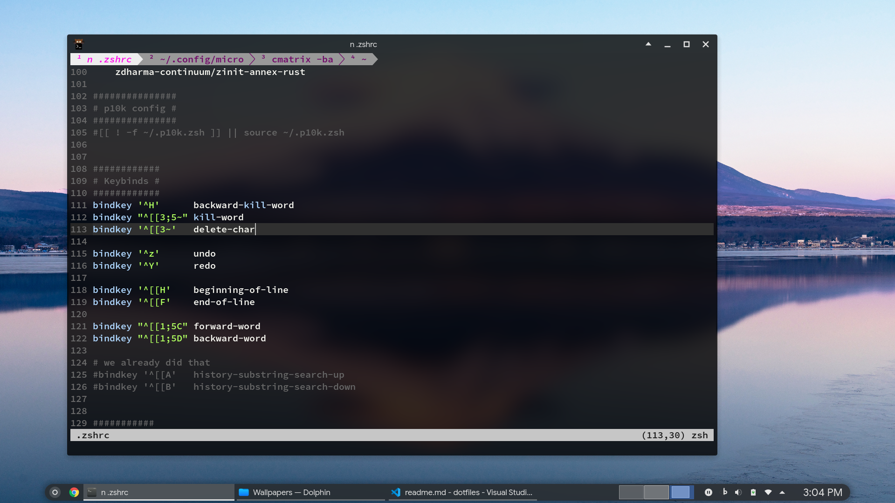
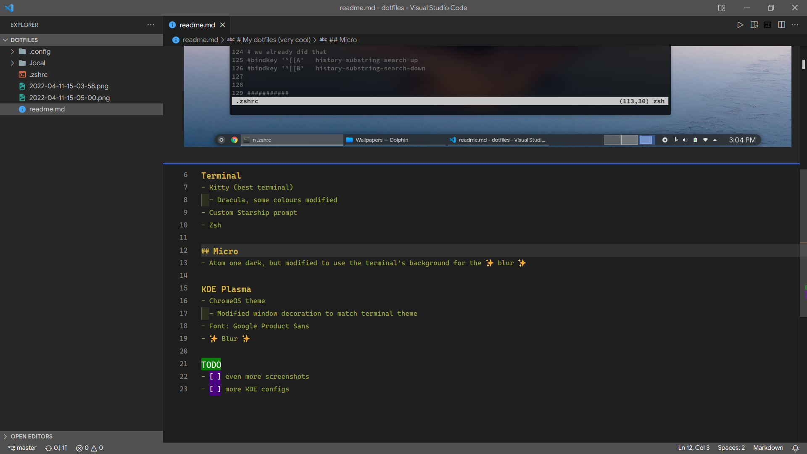

# My dotfiles (very cool)
Managed using yadm

## Terminal
- Kitty (best terminal)
  - Dracula, some colours modified
- Custom Starship prompt
- Zsh
  - fast-syntax-highlighting overlay to change the highlighting for global alias

## Micro
- Atom one dark theme, but modified to use the terminal's background for the ✨ blur ✨
- VSCode-like key bindings
- Made a plugin the emulate the `ctrl + l` behaviour of vscode

## KDE Plasma
- ChromeOS theme
  - Modified window decoration to match terminal theme
- Font: Google Product Sans
- ✨ Blur ✨

## TODO
- [ ] even more screenshots
- [ ] more KDE configs