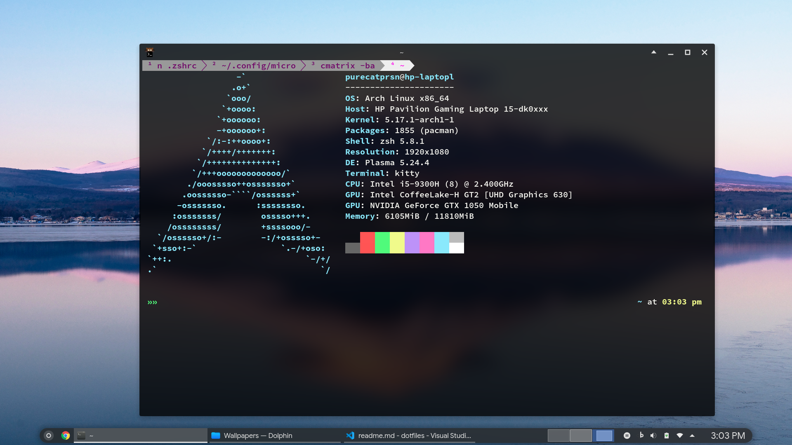
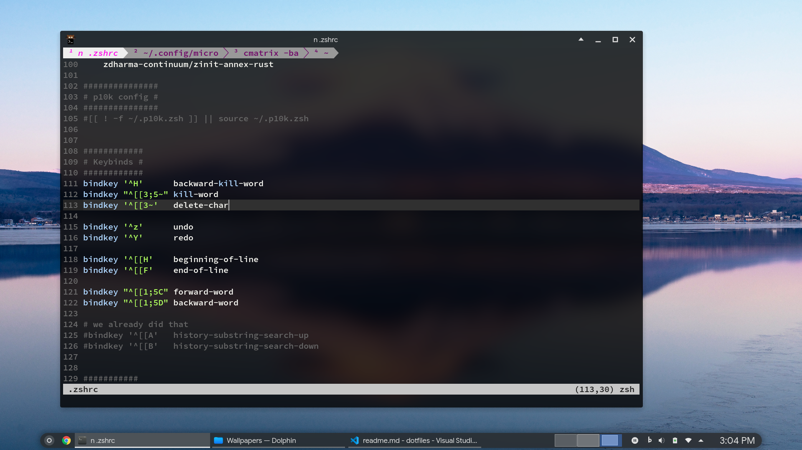
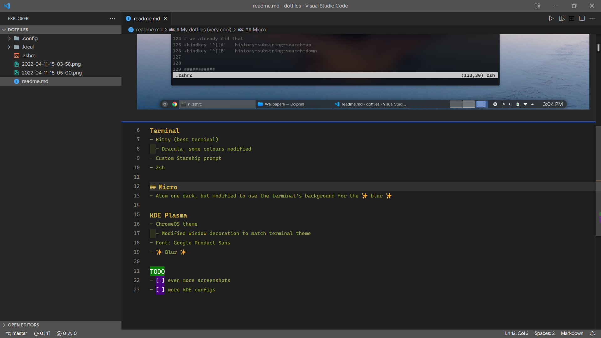

# My dotfiles (very cool)
Managed using yadm. Screenshots are outdated because i'm lazy.

## Included configs
- Kitty
  - Dracula, some colours modified
- FISH
  - Starship prompt
- ZSH
  - no longer used
    - friendship ended with ZSH, FISH is my best friend
  - fast-syntax-highlighting overlay, to change the highlighting for global alias
- Micro
  - Atom one dark theme, but modified to use the terminal's background for the ✨ blur ✨
  - Made a plugin to emulate the `ctrl + l` behaviour of vscode
- KDE Plasma
  - Modified the ChromeOS theme's window decoration, to match terminal theme
- Latte dock
  - honestly i'm not even sure if that's the right file

## Not included configs
- Font:
  - whatever i feel like on that day
  - Google Product Sans my beloved
- Blur

## TODO
- [ ] even more screenshots
- [ ] more KDE configs
